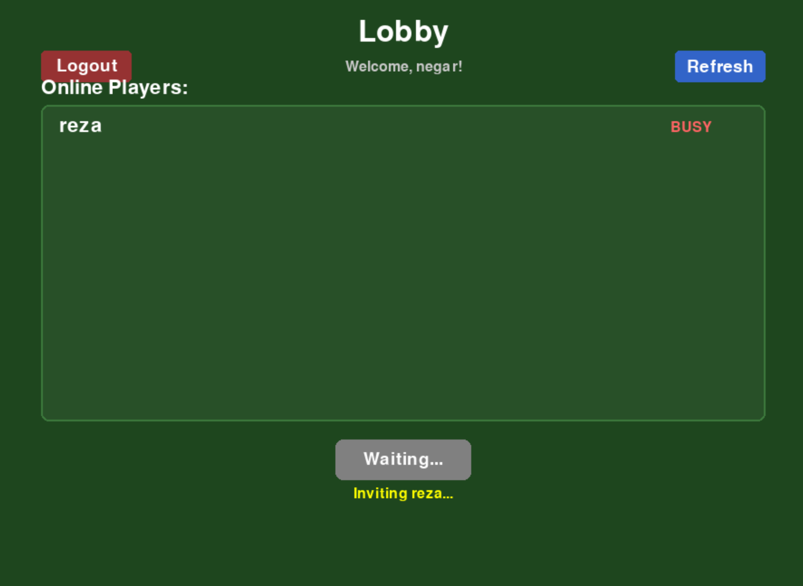
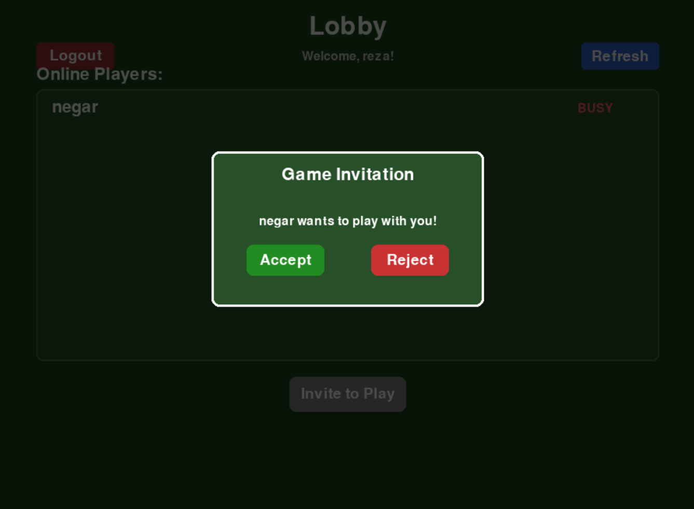
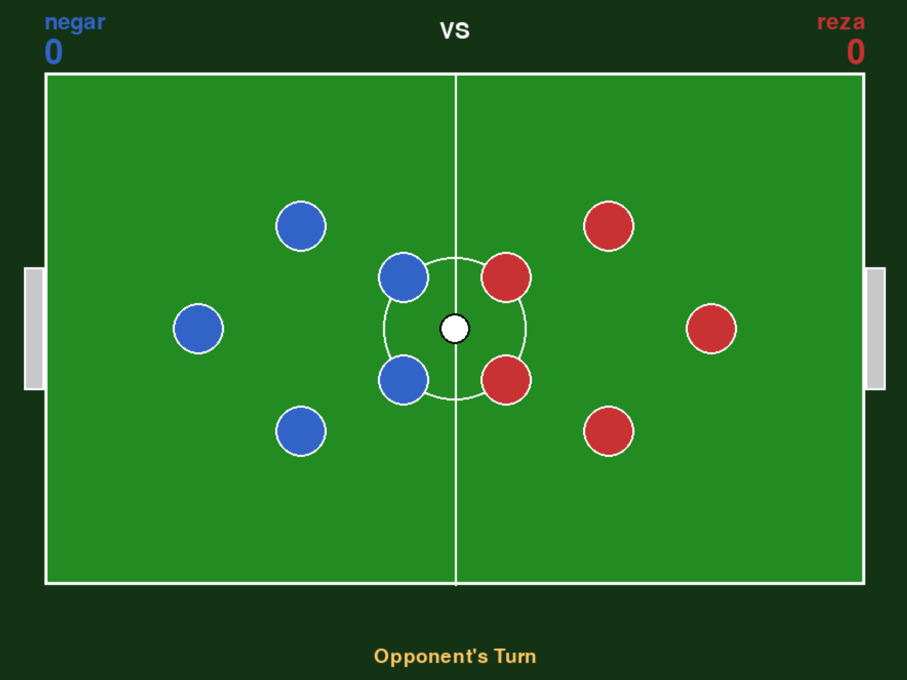

# Soccer Stars — Client

> **Course project** — Computer Networks, Ferdowsi University of Mashhad, Fall 2025 (5th semester - Final)

The game client for **Soccer Stars**, a real-time online 2-player physics game (flick your
pieces to hit the ball into the opponent's goal — think table football / "Soccer Stars"
mobile game). Built with Pygame. Talks to a central server
([Soccer-Stars-Server-Side](https://github.com/Rfarasati/Soccer-Stars-Server-Side)) for
accounts and matchmaking, then plays the match directly peer-to-peer with the opponent.

## Screenshots

| Lobby | Game invitation | Match in progress |
|---|---|---|
|  |  |  |

Two players (`negar`, `reza`) logged in, one inviting the other to a match, then playing —
each controlling 5 pieces (blue/red) around a shared ball, peer-to-peer once the match
starts.

## How it works

- **`network/server_connection.py`** — TCP connection to the matchmaking server: login,
  online-user list, sending/accepting game invitations. Once a match is accepted, the
  server hands both clients each other's IP/UDP port to connect directly.
- **`network/p2p_manager.py`** — the P2P game protocol, over UDP, with a reliability layer
  built on top of unreliable UDP:
  - every message carries a **sequence number**; the receiver tracks seen sequence numbers
    to drop duplicates.
  - messages that must not be lost (`SHOT`, `TURN_END`, `GAME_OVER`) are sent with
    `require_ack=True`; a background thread retries them (up to `MAX_RETRIES`) until the
    matching `_ACK` message arrives.
  - a heartbeat is sent every `HEARTBEAT_INTERVAL`; if nothing is received for
    `HEARTBEAT_TIMEOUT`, the opponent is considered disconnected.
- **`game/game_engine.py`, `game/entities.py`, `game/game_state.py`** — the local physics
  simulation (friction, piece/ball collisions, wall bounces, goal detection). Both clients
  simulate a shot independently and exchange a `stateHash` at `TURN_END` to confirm they
  ended up in the same state, rather than streaming every physics frame over the network.
  Turn order is enforced locally so a player can't shoot out of turn.
- **`ui/`** — the screens: splash (connecting), login, lobby (online users, invitations),
  and the game screen itself.
- After the match ends, the result is reported back to the server over TCP
  (`GAME_OVER` is P2P; the server only learns the outcome via a separate `GAME_RESULT`
  message) so match history and stats stay authoritative on the server even though
  gameplay itself was never observed by it.

## Tech stack

Python, [Pygame](https://www.pygame.org/), the standard library's `socket` (TCP for the
server connection, UDP for P2P gameplay) and `json`/`threading`.

## Running it

```bash
pip install pygame
python client/main.py
```

(run from the repo root — `main.py` adds the repo root to `sys.path` itself so the
`client` package resolves; there is no `client/main` module to run with `python -m`.)

Requires a running instance of the [server](https://github.com/Rfarasati/Soccer-Stars-Server-Side)
(`SERVER_HOST` / `SERVER_PORT` in `client/constants.py`, default `localhost:5001`), and two
client instances (one per player) to actually play a match.

## Project structure

```
client/
    main.py                          — app entry point, screen state machine
    constants.py                      — field/physics/network constants
    network/
        server_connection.py            — TCP client for the matchmaking server
        p2p_manager.py                    — UDP P2P protocol: sequencing, ACK/retry, heartbeat
    game/
        entities.py                        — Piece, Ball, GameObject
        game_engine.py                       — physics: movement, friction, collisions, goals
        game_state.py                          — authoritative game state container
    ui/
        splash_screen.py, login_screen.py,      — the four app screens
        lobby_screen.py, game_screen.py
```
